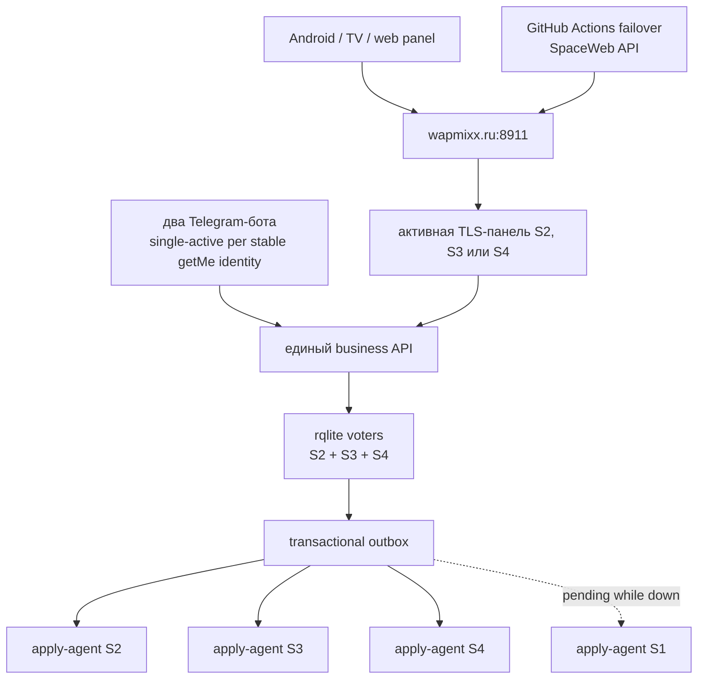

# MaestroVPN: отказоустойчивый control plane S2/S3/S4

**Статус:** утверждено владельцем 09.08.2026; authoritative execution package — `docs/superpowers/plans/2026-08-09-maestrovpn-ha-control-plane.md` и Plans 01–04; production остаётся NO-GO без отдельного approval
**Дата:** 2026-08-09
**Ветка:** `codex/mobile-4d-deck`
**Источник контекста:** `CONTEXT_HANDOFF.md`, раздел 0V
**Production:** не изменён; эта спецификация не разрешает deploy

## 1. Цель

MaestroVPN продолжает создавать и активировать клиентов, продлевать подписки,
отдавать `/sub`, принимать ручные подтверждения оплаты и обслуживать веб-панель
при недоступности любого одного сервера.

Система считается единым организмом:

- одна бизнес-операция имеет один стабильный идентификатор;
- подписка и срок хранятся в одном транзакционном источнике правды;
- доступные VPN-узлы применяют одинаковое желаемое состояние;
- недоступный узел догоняет его после возврата;
- повтор запроса не создаёт клиента, платёж или срок второй раз;
- старое локальное состояние вернувшегося S1 не переписывает кластер.

Главный приёмочный сценарий: клиент нажимает «Я оплатил», владелец проверяет
перевод и подтверждает заказ, после чего срок прибавляется ровно один раз даже
при повторном callback, двух одновременных подтверждениях, потере HTTP-ответа
или перезапуске процесса.

## 2. Зафиксированные ограничения

- Серверов четыре: S1, S2, S3, S4.
- S1 сейчас недоступен; S2/S3/S4 работают.
- Новые платные серверы, балансировщики и внешние подписки запрещены.
- Основа состояния — три voting-узла rqlite на S2/S3/S4. Для записи нужны любые
  два из трёх; отказ одного узла сохраняет кворум.
- S1 не является voting-узлом. После возврата он может быть non-voting replica,
  stateless-панелью и обычным reconciled VPN-узлом.
- Старые приложения продолжают использовать `https://wapmixx.ru:8911`.
- TV-интерфейс и TV-ассеты не изменяются.
- Production, DNS, OTA, systemd, VPN-конфиги и базы нельзя менять до прохождения
  всех GO-гейтов этой спецификации.
- Тяжёлые сборки и fault-тесты выполняются в GitHub Actions.

Три voting-узла выбраны сознательно: три узла выдерживают отказ одного, а четыре
требуют кворум из трёх и не повышают отказоустойчивость
([rqlite cluster guidelines](https://rqlite.io/docs/clustering/general-guidelines/)).

## 3. Почему текущую схему нельзя размножить

Сейчас бизнес-состояние разделено между JSON-файлами панели, SQLite-базой
второго бота, x-ui и локальными конфигами. Mutex защищает только один процесс.
Подтверждение оплаты выполняет продление, затем отдельными записями отмечает
`Credited` и `Paid`. Падение между действиями позволяет повторно прибавить срок.

Отклонены:

1. rsync/репликация JSON;
2. несколько панелей над общим сетевым файлом;
3. долгий dual-write JSON + rqlite;
4. четыре voting-узла;
5. локальная очередь writes при потере кворума;
6. слепой DNS multi-A;
7. новые платные load balancer/VM.

## 4. Целевая архитектура

Панель на S2/S3/S4 — stateless adapter: принимает запрос, проверяет
idempotency, выполняет одну rqlite-транзакцию и возвращает сохранённый
результат. Локальный JSON больше не является источником правды.

Outbox ускоряет применение; периодическая полная reconciliation остаётся
истиной восстановления.

## 5. Данные и обязательные ограничения схемы

| Таблица | Назначение и обязательные ключи |
|---|---|
| `schema_migrations` | версия и checksum миграции |
| `customers` | `customer_id`, исходный login, `login_key UNIQUE`, абсолютная expiry, device limit, generation, status |
| `credentials` | encrypted payload; `UNIQUE(customer_id, kind)` |
| `subscription_tokens` | encrypted token, `token_hmac UNIQUE`; байты существующих tokens сохраняются |
| `devices` | HMAC device ID и лимит без сырого идентификатора |
| `tariff_versions` | immutable amount/currency/duration snapshot; заказ ссылается на конкретную версию |
| `orders` | buyer identity, tariff snapshot, payment/provisioning states, unique high-entropy payment code, result expiry, operation ID, CHECK amount/duration/state |
| `active_order_guards` | PK identity scope/key, `UNIQUE(order_id,identity_scope)`; global Telegram buyer HMAC не зависит от bot/chat/token |
| `payments` | `UNIQUE(order_id)`, `UNIQUE(provider, provider_event_id)` и при наличии `receipt_ref UNIQUE` |
| `trial_redemptions` | идемпотентный trial и anti-abuse identity |
| `idempotency_requests` | PK `(scope, command_type, key)`, canonical request hash, applied status и сохранённый response |
| `nodes` | S1–S4, incarnation, enabled/fenced, cluster epoch |
| `node_services` | управляемые сервисы узла |
| `desired_node_state` | PK `(customer_id,node_id,service_id)`, generation, payload hash, tombstone |
| `outbox_events` | `UNIQUE(operation_id,node_id,service_id,event_kind,generation)` |
| `node_leases` | lease, fencing token и cluster epoch |
| `node_apply_receipts` | PK `(node_id,service_id,customer_id)`, последний epoch/incarnation/fence/generation/hash |
| `tombstones` | удаление до ack всех сервисов и retention |
| `telegram_pollers` | один offset/lease/fence на stable HMAC numeric `getMe.id`; token fingerprint и credential version — только route |
| `telegram_inbox` | PK stable bot identity/update ID, encrypted update, state и fence |
| `telegram_callbacks`, `telegram_delivery_outbox` | durable callback/delivery state с unique business operation ID |
| `telegram_bindings` | global Telegram buyer identity к customer без локальной expiry |
| `cluster_job_leases`, `external_actions` | fenced expiry/backup/WB workers и `pending -> attempt_started -> succeeded|unknown` |
| `operations`, `operation_batches` | crash-resumable endpoint/bulk operations с input/batch digest |
| `import_runs`, `import_batches` | crash-resumable full/delta import с explicit deletes/parent digest |
| `cluster_settings`, `setting_members`, `setting_secrets` | validated public settings, normalized allowlists и row-bound encrypted secrets |
| `principals`, `principal_roles`, `principal_credentials`, `web_sessions` | default-deny RBAC, hashes/envelopes, revocation epoch и sessions |
| `backup_watermarks` | durable dirty generation и last downloaded+verified object digest |
| `tombstone_targets` | frozen required acknowledgement set для hard delete |
| `audit_events`, `rate_limit_buckets` | append-only audit и bounded actor/IP limits |
| `health_write_canary` | bounded per-panel committed nonce row |

Все связи имеют явные FK и ON DELETE policy; отсутствие orphan rows проверяется
миграционным и backup-restore тестом. Login case, UUID, subId, SubToken,
credentials и expiry production-клиентов сохраняются точно.

## 6. Транзакционные инварианты

1. В rqlite хранится абсолютная expiry. Worker не выполняет «+30 дней».
2. Duration, amount и currency берутся только из server-side immutable tariff
   snapshot, не из client body.
3. Canonical command hash содержит только business payload: для оплаты
   `{order_id, decision, tariff_version, payment_reference}`. Actor, channel,
   callback ID и время пишутся в audit, но не меняют hash.
4. Первый writer отправляет одну transaction request. Первая statement делает
   UNIQUE insert в `idempotency_requests`; DB assertion/trigger проверяет
   допустимый order state; payment, expiry, generation, desired state, outbox и
   сохранённый response входят в тот же commit.
5. Нулевая CAS никогда не считается успехом: constraint/`RAISE(ABORT)` откатывает
   весь batch. Plain CAS с последующими безусловными statements запрещён.
6. Concurrent duplicate получает UNIQUE error и не выполняет side effects. После
   rollback приложение делает strong-read operation row: тот же hash возвращает
   сохранённый result, другой hash получает `409 Conflict`.
7. Business-read до first-writer transaction не определяет победителя.
8. Expiry обновляется SQL-выражением внутри write transaction по текущей строке:
   `expiry=max(expiry,confirmed_at)+duration, generation=generation+1`. Поэтому
   параллельные разные оплаченные заказы не теряют одно из продлений.
9. Предложенные server timestamp/UUID используются только transaction, которая
   создала operation row; retry-generated значения игнорируются.
10. Проверяется ошибка каждой rqlite result entry даже при HTTP 200
   ([rqlite transaction API](https://rqlite.io/docs/api/api/)).
11. Queued writes запрещены: они отвечают до Raft commit
   ([rqlite queued writes](https://rqlite.io/docs/api/queued-writes/)).
12. Решения читаются strong/linearizable
   ([rqlite consistency](https://rqlite.io/docs/api/read-consistency/)).
13. При потере quorum writes получают retryable `503`; local pending запрещён.
14. Удаление создаёт tombstone до подтверждения всех сервисов.

## 7. Ручная оплата без дублей

### 7.1 Две независимые оси состояния

- `payment_state`: `created`, `payment_claimed`, `confirmed`, `canceled`,
  `expired`.
- `provisioning_state`: `none`, `pending`, `ready`, `degraded`, `failed`.

`confirmed` и `canceled` — взаимоисключающие terminal payment decisions.
Provisioning никогда не переводит confirmed payment обратно и не разрешает
cancel после начисления.

### 7.2 Создание заказа и «Я оплатил»

- Заказ получает стабильный `order_id = ord_…` и immutable tariff snapshot.
- Неоплаченный заказ не меняет срок.
- Для Telegram и известного customer DB-enforced active guard разрешает один
  non-terminal order на buyer/customer. Повтор возвращает существующий order.
- «Я оплатил» делает CAS `created -> payment_claimed` и создаёт одно событие
- Только невостребованный `created` автоматически expires через 24 часа и освобождает guards.
- `payment_claimed` никогда не исчезает до явного owner confirm/cancel; после 24 часов создаётся один idempotent owner alert.
- Expiry scheduler single-active и проверяет свежий DB lease fence внутри каждой mutation transaction.
  `owner-claim:<order_id>`.
- Payment code уникален и достаточно случаен; короткие legacy-коды сохраняются,
  но не становятся idempotency key.

Старый анонимный Android не передаёт device/idempotency key. После потерянного
create-response он способен создать sibling intent. Поэтому exactly-once
физического неидентифицированного банковского перевода между двумя order IDs
математически невозможно без bank receipt reference. Такие sibling orders
выделяются владельцу; второй нельзя подтвердить тем же `receipt_ref`. Для
ботов этот риск закрывает active buyer guard.

### 7.3 Подтверждение владельцем

Telegram и web вызывают одну canonical command `confirm:<order_id>`.
First-writer transaction:

1. UNIQUE-claim операции и DB assertion ожидаемого `payment_claimed`;
2. terminal CAS `payment_claimed -> confirmed`;
3. `payments` row, уникальная по order и bank/provider reference;
4. одно `confirmed_at`;
5. atomic customer expiry update из текущей DB-строки и `generation + 1`;
6. `provisioning_state=pending`;
7. desired state и уникальные outbox events S1–S4;
8. сохранённые result expiry/generation/operation ID.

Cancel допускается только из `created/payment_claimed` и конкурирует той же
DB-защитой. Duplicate confirm возвращает сохранённый result. Один key с другим
canonical payload получает `409`.

### 7.4 Что видят владелец и клиент

- После commit владелец видит «Подтверждено» или «Уже подтверждено», дату и ID.
- Новый клиент получает наружный `paid` после валидного canonical `/sub` и
  применения generation минимум одним рабочим VPN-контуром.
- До этого confirmed order наружу остаётся legacy `pending`.
- Частично недоступные узлы видны владельцу как `degraded/pending`.
- Клиент не повторяет оплату; S1 догоняет ту же expiry.

## 8. Telegram-боты

Оба бота — stateless adapters к одному API; local SQLite не определяет expiry.

### 8.1 Crash-safe inbox и single-active poller

- Один long-poller на stable `BotIdentityHMAC = HMAC(cluster_key,numeric getMe.id)` получает lease/fence.
- Token fingerprint HMAC и monotonic credential version — только credential route; deployment `BOT_ID` не владеет состоянием.
- `telegram_inbox` проходит `received -> command_committed -> delivery_queued -> completed`.
- `(BotIdentityHMAC,update_id)`, callback HMAC и business operation ID уникальны.
- Bot-to-business command содержит текущий poller fence, проверяемый в той же DB transaction; stale poller не подтверждает заказ.
- Offset двигается только после durable inbox; pending/in-flight callbacks и paid claims также cluster-backed.
- При потере lease poller прекращает `getUpdates` и business API; S2/S3/S4 могут принять lease без overlap.
- Hard fence старого poller предшествует signed capture/import final offset/callbacks/claims и старту нового.
- Token rotation CAS проверяет в памяти тот же numeric `getMe.id`, повышает credential version и сохраняет offset/fence/callbacks.
- Replies создаются только delivery outbox после business commit.
- Webhook на первом этапе не вводится из-за доступных портов 443/80/88/8443
  ([Telegram webhook requirements](https://core.telegram.org/bots/webhooks)).

### 8.2 Сообщения

Owner видит сумму, tariff snapshot, payment code, order ID и кнопки. Callback
сначала закрывает spinner «Проверяю…», затем сообщение перерисовывается из
cluster truth. Token/private URL не выводятся.

Client-ready delivery имеет глобальный key `client-ready:<order_id>`; token/chat хранится отдельно как encrypted route. Exactly-once
гарантируется payment/expiry/generation. Telegram send не имеет idempotency:
crash после принятия сообщения Telegram до receipt способен дать редкий дубль
текста; он несёт тот же operation ID и никогда не повторяет начисление.

### 8.3 Live-дрейф

До cutover полный live source обоих ботов переносится в GitHub; bindings, stable bot identity, credential version, final offset, callbacks и paid claims импортируются по signed digest. Старые poller hard-fenced до capture. Legacy inline buttons временно работают только через imported binding и тот же `confirm:<order_id>` operation key. При rotation новый token обязан вернуть тот же `getMe.id`; чаты/offset сохраняются, старый S1 теряет доступ.

## 9. Subscription URL, API и OTA compatibility

- `sub_url = https://wapmixx.ru:8911/sub/<token>` — MaestroVPN без query.
- `links_url = <sub_url>?format=links` — Karing/iPhone share-links.
- `?app=karing` остаётся legacy alias.
- Основной QR всегда query-free; Karing/iPhone имеет отдельную кнопку/QR.
- `app`, `format`, `device`, `platform` удаляются перед сменой варианта.
- Device metadata не попадает в пересылаемую ссылку.

Сохраняются routes и старые response fields `/sub`, `/claim`, `/order`,
`/trial`, `/update`, `/report` и admin API; новые поля только добавляются.
Legacy payment states наружу остаются `pending/paid`.

Approved OTA manifest хранится как versioned cluster setting и на каждой панели
byte-for-byte сверяется с существующими GitHub Release и Yandex mirror:
versionCode, versionName, APK size и SHA-256. Эта работа не публикует новую OTA
и не меняет TV UI/ассеты.

## 10. Outbox, reconciliation и apply-agent

На S1–S4 работает минимальный apply-agent — единственный writer локальных
VPN-конфигов. Прямой SSH write от panel/worker после cutover запрещён.

Команда содержит cluster epoch, node incarnation, lease fencing token, customer
generation, абсолютный desired state, payload hash и operation ID и подписана
cluster command key.

Перед любым side effect agent делает strong-read текущего lease/fence через
quorum. Если quorum недоступен или token уже не текущий, mutation запрещена, а
last-good VPN продолжает работать. Перед необратимым atomic swap lease
проверяется повторно. Локальная сериализация не позволяет новому worker обойти
уже выполняющуюся проверку.

Agent также:

- отвергает старые epoch/incarnation/generation;
- повтор того же hash выполняет как no-op;
- возвращает receipt с фактическим hash;
- не читает локальную expiry как source of truth.

Для S2 full config обязательны temp file, syntax+semantic validate, atomic swap,
ровно один reload, health check и last-good rollback.

Periodic reconciler сравнивает desired snapshot и receipts. Старый
`dates-reconcile.py` становится audit-only.

## 11. Fencing и возврат S1

До первой rqlite business-write доказывается fence matrix:

- S1 удалён из public ingress;
- старые panel/admin/API/agent credentials отозваны;
- новый cluster CA не доверяет старому S1;
- S1 management access к S2/S3/S4 заблокирован firewall и отзывом SSH keys;
- старые bot tokens/pollers отозваны или повернуты;
- старые reconcile identities не могут писать ни cluster, ни VPN nodes.

Недоступность S1 сама по себе не является fencing. Если provider control не
позволяет исключить его неожиданное возвращение старым writer, статус `NO-GO`.

После возврата:

1. S1 остаётся изолированным; снимается forensic backup.
2. Старые panel/bot/write-reconciler не запускаются.
3. S1 получает новый credential и увеличенный incarnation.
4. Agent получает полный desired snapshot и tombstones.
5. Применяются прежние login/UUID/subId/SubToken/credentials/expiry.
6. Hash/receipt сверяется с cluster truth.
7. После catch-up S1 возвращается как VPN-узел и optional non-voter.

Stale S1 JSON/x-ui никогда не импортируется назад.

## 12. Бесплатный ingress, TLS и DNS

На S2/S3/S4 заранее работают одинаковые TLS listeners `:8911`; hostname старых
приложений не меняется.

### 12.1 S1 VLESS

Owner checkpoint 29.08.2026 supersedes the prior S1 identity: the sole current
future target is `193.17.183.48` (`ubuntu24`); the predecessor is permanently
retired and must not be used for a cutover step.

До cutover под общим SpaceWeb lock создаётся ровно `s1-vless.wapmixx.ru -> 193.17.183.48` и фиксируется signed provider/TTL proof; доступность S1 не требуется, потому что rescue несут S2/S3/S4. Во время freeze resumable CAS меняет у всех только server host S1 VLESS `wapmixx.ru -> s1-vless.wapmixx.ru`, сохраняя UUID/SubID/SubToken/password/SNI/PBK/SID/fingerprint/flow, один раз повышает generation и создаёт desired/outbox. Apex gate требует zero new `wapmixx.ru:443` VLESS и независимый S2/S3/S4 fallback у legacy-клиентов.

### 12.2 TLS до DNS-переключения

Каждый неактивный S2/S3/S4 заранее имеет действующий certificate именно для
`wapmixx.ru`. HTTP-01 не используется. DNS-01 workflow держит SpaceWeb secret
только в GitHub environment, не публикует key artifact, доставляет certificate
по защищённому каналу и применяет его атомарно после config-test.

До допуска узла проверяются direct-IP connection с правильным SNI, full chain,
expiry и reload rollback. Renewal failure даёт alert заранее и не заменяет
last-good certificate.

### 12.3 Active-only DNS без новых расходов

- SpaceWeb authoritative; apex содержит ровно один ready A и не имеет AAAA/CNAME/ANAME/ALIAS/flattening/wildcard обхода.
- Scheduled failover каждые 5 минут использует branch-restricted `production-dns-auto` без per-run reviewer; manual override использует reviewed отдельную environment.
- Все SpaceWeb apex/TTL/alias/ACME mutations держат один `maestro-spaceweb-dns-mutations` lock, SHA-pinned actions, exact allowlist и read-before-write.
- Failover требует consecutive active failures/candidate successes; failback имеет более длинный hysteresis.
- GitHub-hosted workflow видит только public mTLS probe/status/failover CAS, а не private rqlite/agent.
- После irreversible marker DNS rollback allowlist содержит только write-ready S2/S3/S4; ambiguous initial switch никогда автоматически не возвращает S1.
- Secrets/canary URL отсутствуют в artifact/log; PR не получает secrets.
- TTL снижается с ожиданием прежнего TTL. Реальный RTO —
  detection + GitHub delay + DNS propagation/cache + client retry.

### 12.4 Read/write health

- `/healthz` сохраняется для совместимости; `/livez` проверяет процесс.
- `/readyz/read` требует schema/keys/settings и последний verified strong commit.
- `/readyz/write` требует quorum, strong read, disk space и свежий committed
- Public nginx запрещает исходные `/readyz/read|write`; automation использует только client-cert-protected `/readyz/probe/read|write` и nonce-bound redacted status/CAS routes.
- Sensitive `/sub`, order и probe logs не содержат request URI/query/token/header/body.
  write-canary. Canary обновляет одну bounded health row и затем strong-read
  проверяет nonce; rollback-only probe не считается доказательством write.
- Black-box проверяет direct-IP TLS/SNI, tariffs, approved OTA manifest и secret
  canary `/sub` с config validation.
- При global no-quorum DNS не флапает и не выбирает другого follower.
- Текущий active node может отдавать только последний committed `/sub`, если
  strong-sync age в момент аварии был допустим; stale grace максимум 60 минут.
  `/claim`, orders, trials, confirm/cancel в это время возвращают `503`.
- После grace `/sub` также возвращает `503`; установленный клиент сохраняет
  last-good config. Это ограничивает риск выдачи отозванной stale subscription.

## 13. Авторизация и безопасность

- rqlite HTTP/Raft и agent ports закрыты от public internet; firewall+mTLS.
- Cluster CA/keys не хранятся в Git.
- Tokens/credentials encrypted; lookup использует отдельный HMAC.
- Web роли: owner может confirm/cancel и менять критические settings; admin имеет
  явно перечисленные меньшие permissions; default deny.
- Web session: Secure/HttpOnly/SameSite cookie, short TTL, CSRF token, revocation
  epoch и rate limits по actor/IP.
- Telegram callback связан с bot/order/action/owner, имеет expiry и проверяет
  allowlisted `from_user.id`; bot-to-API использует service identity+mTLS+fence.
- Confirm/cancel всегда повторно авторизуются server-side, независимо от UI.
- Audit trail append-only хранит actor, channel, decision, order, operation ID,
  timestamp и result hash.
- SpaceWeb secret только в protected GitHub environment; provider не даёт
  доказанного zone-scoped token, это принятый остаточный риск бесплатной схемы.
- Логи/Telegram/artifacts не содержат SubToken, private URL или credentials.

## 14. Миграция и cutover

### A. GitHub/CI

- Migrations, adapter, fake agents, importer и isolated 3-node rqlite.
- Fault injection без production credentials.

### B. Read-only inventory и fence plan

Снимаются consistent backups S1 JSON/orders/trials/settings/x-ui, S2 bot DB и
config, S3/S4 x-ui, оба live bot checkout, counts/hashes. Отдельно составляется
fence matrix всех credentials, tokens, SSH keys, network paths и writers.
Importer сохраняет exact values; любой unresolved conflict означает `NO-GO`.

### C. Shadow

- Новые panels без public writes; shadow `/sub` для каждого customer.
- Сверяются credentials, expiry, tags, nodes, share-links и OTA manifest.
- Agents dry-run; owner canary проходит isolated flow.

### D. Production cutover

1. Подготовить shadow cluster/TLS/probes, S1 alias и initial full import dry-run.
2. Ввести global freeze app/panel/admin/bots/reconcilers/olcRTC/legacy backup.
3. Остановить old pollers, signed-capture stable bot identity/final offset/callbacks/claims и доказать всю fence matrix.
4. Final backup и crash-resumable delta import; linearizable digest reconciliation.
5. До activation выполнить S1 endpoint migration и zero-apex-VLESS/fallback gate.
6. Canary-only agents: Naive zero-unowned, S3 olcRTC, receipts/log/backup/dashboard gates.
7. По отдельному approval атомарно записать irreversible marker с первой live owner canary business command.
8. Выполнить owner create/renew/paid-claim/confirm и доказать одну payment/expiry/generation.
9. После отдельного production approval переключить single apex A на ready HA; ambiguity не возвращает S1.
10. Стартовать новые pollers с imported offset в legacy-callback replacement mode.
11. Выполнить allowlisted «Я оплатил → owner confirm» canary через каждую bot configuration без cross-bot дубля.
12. Закрыть replacement только при zero pending imported work.
13. Постепенно открыть writes и наблюдать quorum/lag/outbox/DNS/TLS/backup/RPO/RTO.

Если пункт 2 нельзя доказать, первая business-write и DNS cutover запрещены.

## 15. Rollback и disaster-recovery epoch

До irreversible marker pre-activation cluster можно discard, а старую маршрутизацию вернуть только при доказанном freeze/fence. Marker коммитится с первой live business command. После marker JSON/SQLite — stale forensic archive, S1 запрещён как DNS rollback target; разрешены только previous binary на том же rqlite либо write-freeze + verified rqlite export. Dual-write/reverse import запрещены.

Cluster restore выполняется при fenced agents/pollers и отсутствии writes
([rqlite backup/restore](https://rqlite.io/docs/guides/backup/)). После restore
создаётся новый monotonic restore/cluster epoch выше всех epoch в node receipts.
Agents принимают signed activation нового epoch только после reconciliation;
старые commands/leases/receipts не могут перезаписать восстановленное состояние.

## 16. Backup, RPO/RTO и наблюдаемость

Canonical DR backup — SQLite image через rqlite API; schema/epoch/counts/receipt high-watermarks выводятся из скачанного image, а не racing live reads. Каждый business commit повышает durable dirty watermark; single-active capability-ready worker на S2/S3/S4 coalesces on-change, делает backup не реже часа и подтверждает watermark только после re-download/signature/hash verification. Application keys находятся в encrypted signed bundle; plaintext temp закрыт `0700/0600` и очищается trap/startup recovery. Raft directories — только forensic material.

Backup шифруется до существующего Yandex Object Storage. Legacy JSON/SSH backup units запрещены в rqlite mode и конфликтуют с HA worker. Retention не может быть
хуже текущей on-change/hourly политики. Целевой RPO — не более 1 часа; RTO
измеряется restore drill и публикуется владельцу, а не обещается без измерения.
Пустой 3-node restore drill обязателен регулярно и перед cutover.

Панель показывает quorum/leader, read/write readiness, generation/lag, pending
outbox, bot inbox/poller, DNS target, certificate expiry, backup/restore/RPO/RTO
и append-only audit trail.

## 17. Обязательные тесты

1. 100 concurrent same confirm дают одну payment row/expiry delta/generation.
2. Concurrent first-writer с тем же key и разным hash: один commit, второй `409`.
3. Lost response после commit возвращает сохранённый result.
4. Два разных paid orders параллельно последовательно прибавляют оба срока.
5. Bot active-order guard возвращает один order; sibling physical receipt нельзя
   подтвердить повторно.
6. Confirm-vs-cancel даёт один terminal payment state; provisioning отдельно.
7. Leader kill до/после commit; one node down сохраняет writes; no quorum — `503`.
8. Bot crash на каждом inbox state, duplicate update/callback и stale poller fence.
9. Telegram duplicate text не вызывает business command повторно.
10. Agent отвергает old token, даже если ещё не видел новый: quorum lease check.
11. Потеря quorum запрещает side effects; last-good VPN продолжает работать.
12. Crash после side effect до receipt; retry — hash no-op.
13. S1 down create/renew/delete; rejoin exact parity+tombstones.
14. S2 config validate/atomic swap/one restart/last-good rollback.
15. Importer corrupt input/collisions/`pending+credited` без начисления.
16. URL contract: Maestro query-free, Karing links, metadata stripped.
17. DNS workflow: protected secrets, allowlist, hysteresis, delayed schedule,
   rollback и запрет unready target.
18. TLS renew/install/rollback и direct-IP SNI на каждом S2/S3/S4.
19. Disk-full/read-only делает write-canary и `/readyz/write` красными.
20. No-quorum `/sub` соблюдает committed snapshot и 60-minute stale grace.
21. Exact current production TV APK contract проверяет `/claim`, `/sub`,
   `/update`; UI/assets не меняются.
22. Panel/GitHub/Yandex OTA versionCode/versionName/size/SHA совпадают без
   публикации новой OTA.
23. Backup restore на empty cluster создаёт новый epoch и отвергает old commands.
24. Owner canary показывает одно продление и одинаковую expiry на ready nodes.

## 18. GO/NO-GO

Production получает `GO` только если одновременно:

- CI и все fault/contract/security tests GREEN;
- importer blocker count = 0 и shadow credential/expiry diff = 0;
- full backup, authenticated manifest и restore-epoch drill пройдены;
- fence matrix S1/panel/bots/reconciler/SSH/network доказана;
- TLS/readiness/write-canary S2/S3/S4 доказаны;
- DNS dry-run/rollback и измеренный best-effort RTO зафиксированы;
- live source обоих ботов находится в GitHub и inbox/fencing проверены;
- current TV APK и OTA parity checks GREEN;
- owner canary дал одну payment row, expiry delta и generation;
- code review не имеет Critical/Important.

Иначе production остаётся `NO-GO`.

## 19. Вне scope

- автоматическая проверка банка или новый платёжный провайдер;
- новые платные серверы/балансировщики;
- TV UI/ассеты;
- изменение VPN-протоколов ради миграции;
- новая OTA без отдельного approval;
- stale JSON как источник истины после cutover.

## 20. Операционные входы на позднем этапе

- последний зашифрованный S1 backup;
- контроль провайдера для fencing/возврата S1;
- read-only inventory S2/S3/S4;
- полный live source обоих ботов;
- SpaceWeb credentials, введённые только как GitHub encrypted secrets;
- owner/admin Telegram IDs;
- отдельное явное разрешение production cutover.

До этого можно безопасно реализовать код, importer, CI, runbooks и dry-run.
